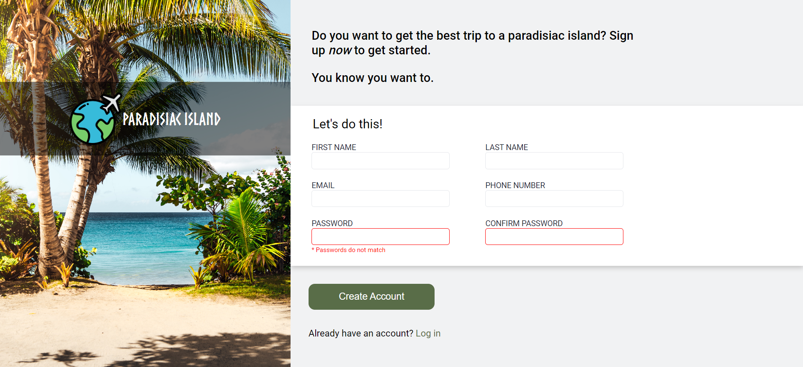
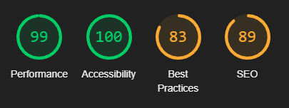
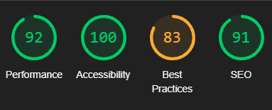

<h1>Brainnest Project Sign Up Advanced Course - CSS & HTML</h1>

<h1>Deployment</h1>

<ul>
    <h2>Using Github Pages</h2>
    <li>
        Navigate to the GitHub <a href="#" target="_blank">Repository</a>:
    </li>
    <li>
        Click the 'Settings' Tab.
    </li>
    <li>
        Scroll Down to the Git Hub Pages Heading.
    </li>
    <li>
        Select 'Master Branch' as the source.
    </li>
    <li>
        Click the Save button.
    </li>
    <li>
        Click on the link to go to the live deployed page.
    </li>
    <li><h2>
        <a href="#">
        Preview</a>
</h2></li>
</ul>

<ul>
    <h2>Run Locally</h2>
    <li>
        Navigate to the GitHub <a href="#" target="_blank">Repository</a>:
    </li>
    <li>
        Click the Code drop down menu.
    </li>
    <li>
        Either Download the ZIP file, unpackage locally and open with IDE (This route ends here) OR Copy Git URL from the HTTPS dialogue box.
    </li>
    <li>
        Open your developement editor of choice and open a terminal window in a directory of your choice.
    </li>
    <li>
        Use the 'git clone' command in terminal followed by the copied git URL.
        A clone of the project will be created locally on your machine.
    </li>
</ul>
<h1>Color Scheme & Client Wireframes</h1>

<h1>Technologies</h1>
<h3>Google Fonts:</h3>

     
    <a href="https://fonts.google.com/" target="_blank">Google Fonts</a>
    was used to change the font for the websites logo

<h3>GitPod:</h3>

     
    <a href="https://www.gitpod.io/" target="_blank">GitPod</a>
    was used to write up the code for the project and using the GitPod terminal to commit everything to GitHub.

<h3>GitHub:</h3>
    
 
    <a href="https://github.com/" target="_blank">GitHub</a>
    was used to store all the code for this project after being pushed from GitPod.

<h3>Google Chrome Developer Tools:</h3>

     
    Developer Tools was used for trouble shooting and trying new visual changes without it affect the current code already created.

<h3>Lighthouse:</h3>

     
    <a href="https://chrome.google.com/webstore/detail/lighthouse/blipmdconlkpinefehnmjammfjpmpbjk/related?hl=en" target="_blank">Lighthouse Extension
    </a>
    was used to analyze the following aspects of a URL: Performance, Progressive Web App, Accessibility, Best Practices and SEO. 
    A high Lighthouse score also means that you have a well performing website. The speed that a page loads at is extremely important as users do not want to sit around waiting for your webpage to load.

    <h4>How to access Lighthouse without Extension:</h4>
<ol>
    <li>
        On any website if you are on windows you can press F12 on your keyboard and it will open the developer tool. From there you can access Lighthouse
    </li>
    <li>   
        You can also right click on pages and click "Inspect" and you'll have the same pathway to Lighthouse through developer tools.
    </li>
</ol>

<h3>HTML:</h3>

     
    <a href="https://en.wikipedia.org/wiki/HTML" target="_blank">HTML</a> 
    was used to construct the core of the website.

<h4>Why HTML :</h4>

    HTML code ensures the proper formatting of text and images for Internet browsers. Without HTML, a browser would not know how to display text as elements or load images or other elements.

<h3>CSS:</h3>

     
    <a href="https://en.wikipedia.org/wiki/CSS" target="_blank">CSS</a>
    was used to style the website after the core was made.

<h4>Why CSS :</h4>

    CSS makes the front-end of a website shine and it creates a great user experience. Without CSS, websites would be less pleasing to the eye and likely much harder to navigate. In addition to layout and format, CSS is responsible for font color and more.

<h3>JavaScript:</h3>

     
    <a href="https://en.wikipedia.org/wiki/JavaScript" target="_blank">JavaScript</a>

<h4>Why JavaScript :</h4>

    JavaScript has become integral to the Internet experience as developers build increased interaction and complexity into their applications. Search engines, ecommerce, content management systems, responsive design, social media and phone apps would not be possible without it.

<h1>Testing</h1>
<h3>Code Validators</h3>
<ul>
    <li>W3C <a href="https://validator.w3.org/nu/#textarea">Html Checker
    </a></li>
    <li>W3C <a href="https://jigsaw.w3.org/css-validator/#validate_by_input"
    target="_blank">CSS Validator Results
    </a></li>
</ul>

<li>Lighthouse Validator Results:</li>
<h4>Desktop:</h4>

<h4>Moblie:</h4>

<h2>Lighthouse:</h2>
<h3>And why It's important to run before deployment</h3>

<strong>Performance : </strong>
    refers to the speed in which web pages are downloaded and displayed on the user's web browser. Website performance optimization, or website optimization is the field of knowledge about increasing web performance

<strong>Accessibility : </strong>
    means that websites, tools, and technologies are designed and developed so that people with disabilities can use them. More specifically, people can: perceive, understand, navigate, and interact with the website.

<strong>Best Practices : </strong>
    are related to how to carry out a task or configure something. Strict best practice guidelines may be set by a governing body or may be internal to an organization.

<strong>SEO : </strong> 
    stands for 'Search Engine Optimization', which is the process of getting traffic from free, organic, editorial, or natural search results in search engines. It aims to improve your website's position in search results pages. Remember, the higher the website is listed, the more people will see it.

